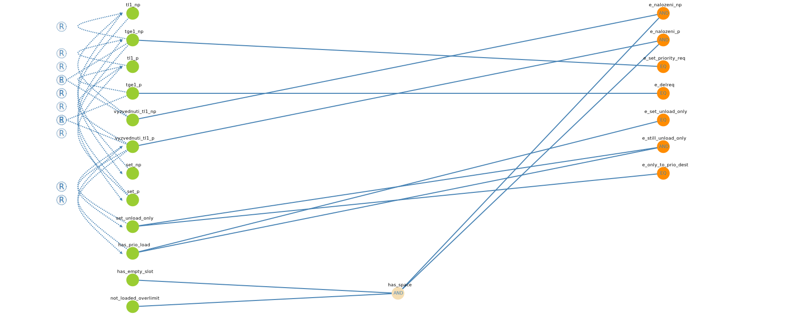

# Dokumentace testů pro Řízení vozíku v robotické továrně
## 1. CEG graf a výsledná rozhodovací tabulka
CEG graf a výsledná rozhodovací tabulka byly vygenerovány pomící nástroje přístupného na stránce http://ceg.testos.org

### CEG Graf
Graf lze nalézt ve složce jako `ceg.png` nebo `ceg.svg`


### Výsledná rozhodovací tabulka

Vybrané kombinace pro pokrytí testy

|         **Name**         |                                   **Description**                                    | **[1]** | **[2]** | **[3]** | **[4]** | **[5]** | **[6]** | **[7]** |
| :----------------------: | :----------------------------------------------------------------------------------: | :-----: | :-----: | :-----: | :-----: | :-----: | :-----: | :-----: |
|        **tl1_np**        |  Časové pásmo: Vyzvednutí trvá < 1m od přijetí NEprioritního požadavku. (time < 1m)  |    0    |    1    |    1    |    1    |    1    |    1    |    1    |
|       **tge1_np**        | Časové pásmo: Vyzvednutí trvá >= 1m od přijetí NEprioritního požadavku. (time >= 1m) |    0    |    0    |    1    |    1    |    0    |    0    |    0    |
|        **tl1_p**         |   Časové pásmo:  Vyzvednutí trvá < 1m od přijetí prioritního požadavku (time < 1m)   |    0    |    0    |    1    |    1    |    0    |    0    |    0    |
|        **tge1_p**        |  Časové pásmo: Vyzvednutí trvá >= 1m od přijetí prioritního požadavku. (time >= 1m)  |    0    |    0    |    0    |    1    |    0    |    0    |    0    |
|  **vyzvednuti_tl1_np**   |                          Vyzvednutí nákladu v pásmu tl1_np.                          |    0    |    1    |    0    |    0    |    1    |    1    |    0    |
|   **vyzvednuti_tl1_p**   |                          Vyzvednutí nákladu v pásmu tl1_p.                           |    0    |    0    |    1    |    0    |    0    |    0    |    0    |
|        **set_np**        |                          Nastavení NEprioritního požadavku.                          |    0    |    1    |    1    |    1    |    1    |    1    |    1    |
|        **set_p**         |                           Nastavení priotitního požadavku.                           |    0    |    0    |    1    |    1    |    0    |    0    |    1    |
|   **set_unload_only**    |                          Přepnutí do režimu jenom vykládka                           |    0    |    0    |    1    |    0    |    0    |    0    |    0    |
|    **has_prio_load**     |                                 Má prioritní náklad.                                 |    0    |    0    |    1    |    0    |    0    |    0    |    0    |
|    **has_empty_slot**    |                              Má alespoň 1 prázdný slot.                              |    1    |    1    |    1    |    1    |    0    |    1    |    0    |
| **not_loaded_overlimit** |               V případě naložení nákladu je vozík přes limit nosnosti.               |    1    |    1    |    1    |    1    |    0    |    0    |    1    |
|    **e_nalozeni_np**     |                       Naložení neprioritního nákladu na vozík.                       |  False  |  True   |  False  |  False  |  False  |  False  |  False  |
|     **e_nalozeni_p**     |                        Naložení prioritního nákladu na vozík.                        |  False  |  False  |  True   |  False  |  False  |  False  |  False  |
|  **e_set_priority_req**  |                           Je nastaven prioritní požadavek.                           |  False  |  False  |  True   |  True   |  False  |  False  |  True   |
|   **e_delreq_infomsg**   |          Odstranění prio požadavku a odeslání info zprávy o překrožení času          |  False  |  False  |  False  |  True   |  False  |  False  |  False  |
|  **e_set_unload_only**   |           Přepnutí do režimu pouze vykládka pokud naloží prioritní náklad            |  False  |  False  |  True   |  False  |  False  |  False  |  False  |
| **e_still_unload_only**  |       Zůstává v režimu pouze vykládka dokud nevyloží veškerý prioritní náklad.       |  False  |  False  |  True   |  False  |  False  |  False  |  False  |
| **e_only_to_prio_dest**  |   Vozík je v režimu pouze vykládka a jede jenom do cíle daným prioritním nákladem.   |  False  |  False  |  True   |  False  |  False  |  False  |  False  |

## 2. Identifikace vstupních parametrů

Vstupních parametrů je více než je vypsáno v tabulce. V tabulce byly vypsány vstupní paramtery využity pro mé testy.  

|       **Název**       |                     **Stručný popis**                     |
| :-------------------: | :-------------------------------------------------------: |
|     **cargo_src**     |                 Zdrojová stanice nákladu.                 |
|     **cargo_dst**     |                  Cílová stanice nákladu.                  |
|   **cargo_weight**    |               Váha nákladů (jejich součet).               |
| **cart_weight_limit** |                      Nosnost vozíku.                      |
|    **cart_slots**     |                    Počet slotů vozíku.                    |
|     **mult_req**      | Více jak jeden požadavek na stejnou trasu ve stejnou dobu |


## 3. Popis charakteristiky parametrů  

| **cargo_src** | **Přístupné zdrojové stanice.** |
| :-----------: | :-----------------------------: |
|       1       |                A                |
|       2       |                B                |
|       3       |                C                |
|       4       |                D                |

| **cargo_dst** | **Přístupné cílové stanice.** |
| :-----------: | :---------------------------: |
|       1       |               A               |
|       2       |               B               |
|       3       |               C               |
|       4       |               D               |

| **cargo_weight** | **Možné váhy nákladů (jejich součet).** |
| :--------------: | :-------------------------------------: |
|        1         |                   30                    |
|        2         |                   80                    |
|        3         |                   400                   |

| **cart_weight_limit** | **Možné nosnosti vozíku.** |
| :-------------------: | :------------------------: |
|           1           |             50             |
|           2           |            150             |
|           3           |            500             |

| **cart_slots** | **Dostupný počet slotů vozíku.** |
| :------------: | :------------------------------: |
|       1        |                1                 |
|       2        |                2                 |
|       3        |                3                 |
|       4        |                4                 |

| **mult_req** | **Bylo nastaveno více jak jeden požadavek na stejnou trasu ve stejnou dobu** |
| :----------: | :--------------------------------------------------------------------------: |
|      1       |                                     True                                     |
|      2       |                                    False                                     |

### Omezení bloků charakteristik

```
cargo_src.1 -> !cargo_dst.1
cargo_src.2 -> !cargo_dst.2
cargo_src.3 -> !cargo_dst.3
cargo_src.4 -> !cargo_dst.4
cargo_weight.2 -> !cart_weight_limit.1
cargo_weight.3 -> cart_weight_limit.3
(cart_weight_limit.1 and cart_slots.1) -> cargo_weight.1
cart_weight_limit.1 -> !(cart_slots.2)
cart_weight_limit.3 -> (cart_slots.2 or cart_slots.1)
```

### Kombinace dvojic bloků

Tabulka byla vygenerována pomící nástroje přístupného na stránce http://combine.testos.org  
Konfigurace pro generování lze nalézt v `combine.json`.  


| **ID** | **cargo_src** | **cargo_dst** | **cart_slots** | **cargo_weight** | **cart_weight_limit** | **mult_req** |
| :----: | :-----------: | :-----------: | :------------: | :--------------: | :-------------------: | :----------: |
|   1    |       A       |       B       |       1        |        30        |          50           |     true     |
|   2    |       A       |       C       |       2        |        80        |          150          |    false     |
|   3    |       A       |       D       |       3        |        30        |          150          |     true     |
|   4    |       B       |       A       |       1        |        80        |          500          |     true     |
|   5    |       B       |       C       |       3        |        30        |          50           |    false     |
|   6    |       B       |       D       |       2        |       400        |          500          |    false     |
|   7    |       C       |       A       |       2        |        30        |          150          |     true     |
|   8    |       C       |       B       |       3        |        80        |          150          |    false     |
|   9    |       C       |       D       |       1        |       400        |          500          |     true     |
|   10   |       D       |       A       |       3        |        30        |          50           |    false     |
|   11   |       D       |       B       |       2        |       400        |          500          |     true     |
|   12   |       D       |       C       |       1        |        80        |          150          |     true     |
|   13   |       B       |       C       |       4        |        30        |          150          |     true     |
|   14   |       A       |       D       |       4        |        80        |          150          |    false     |
|   15   |       B       |       A       |       4        |        30        |          50           |     true     |
|   16   |       A       |       B       |       4        |        30        |          50           |     true     |
|   17   |       A       |       B       |       4        |        30        |          50           |     true     |
|   18   |       D       |       A       |       4        |        30        |          50           |     true     |
|   19   |       C       |       A       |       4        |        30        |          50           |     true     |
|   20   |       B       |       A       |       1        |       400        |          500          |    false     |
|   21   |       A       |       C       |       1        |       400        |          500          |     true     |
|   22   |       A       |       B       |       1        |       400        |          500          |     true     |
|   23   |       A       |       A       |       1        |        30        |          500          |     true     |
|   24   |       A       |       D       |       1        |        30        |          50           |     true     |


### Pokrytí testů

#### Pokrytí CEG rozhodovací tabulky

| **Název testu** | **ID** |
| :-------------: | :----: |
|   test_ceg_01   |  [1]   |
|   test_ceg_02   |  [2]   |
|   test_ceg_03   |  [3]   |
|   test_ceg_04   |  [4]   |
|   test_ceg_05   |  [5]   |
|   test_ceg_06   |  [6]   |
|   test_ceg_07   |  [7]   |

#### Pokrytí tabulky kombinace dvojic bloků

Pro některé kombinace se neuplatnily omezení viz **ID:** `23` (je stejná src a dst stanice)  
A vyskytla se i duplikace předchozí kombinace viz **ID:** `17` (duplikace ID: `16`)  

| **Název testu** | **ID** |
| :-------------: | :----: |
| test_combine_01 |   1    |
| test_combine_02 |   2    |
| test_combine_03 |   3    |
| test_combine_04 |   4    |
| test_combine_05 |   5    |
| test_combine_06 |   6    |
| test_combine_07 |   7    |
| test_combine_08 |   8    |
| test_combine_09 |   9    |
| test_combine_10 |   10   |
| test_combine_11 |   11   |
| test_combine_12 |   12   |
| test_combine_13 |   13   |
| test_combine_14 |   14   |
| test_combine_15 |   15   |
| test_combine_16 |   16   |
| test_combine_18 |   18   |
| test_combine_19 |   19   |
| test_combine_20 |   20   |
| test_combine_21 |   21   |
| test_combine_22 |   22   |
| test_combine_24 |   24   |

